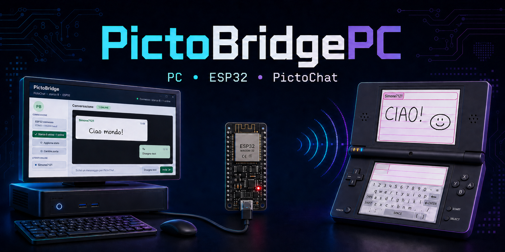
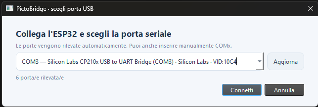
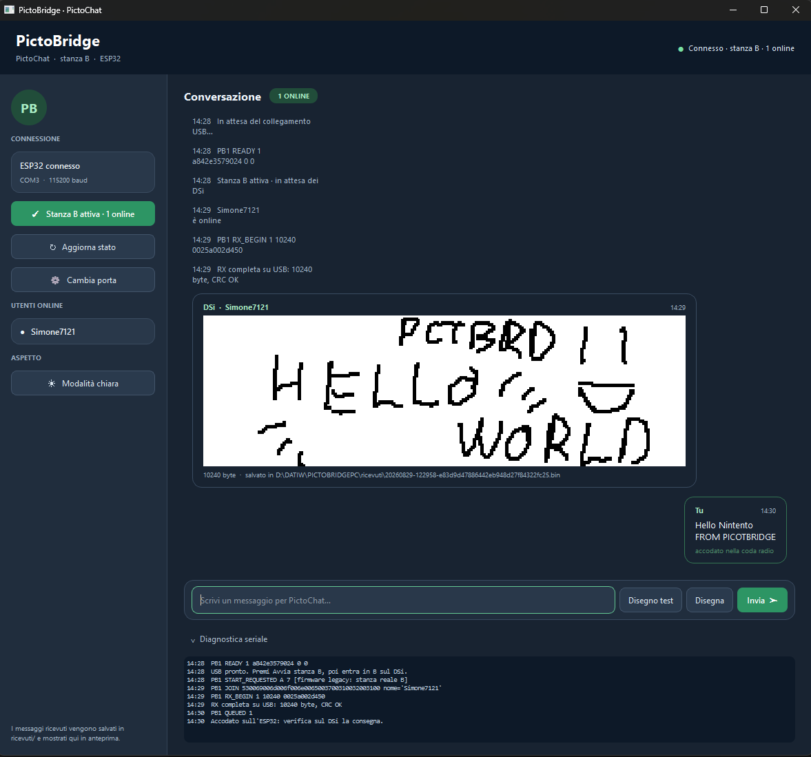
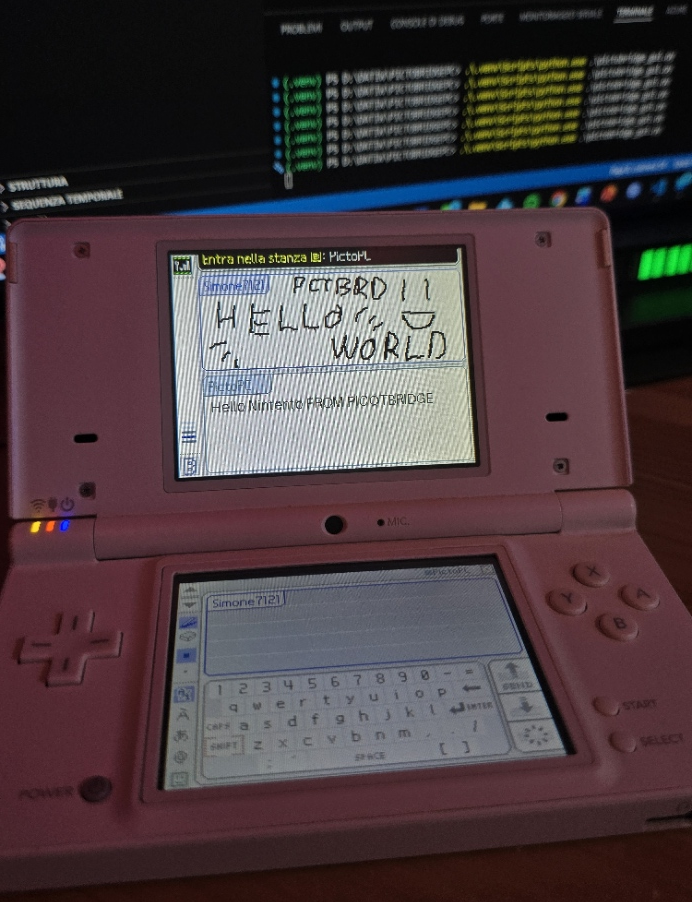

# PictoBridgePC



Bridge sperimentale tra un PC Windows/Linux, un ESP32 classico e Nintendo DSi
PictoChat. Il progetto permette di entrare nella stanza B, inviare testo o
disegni dal PC e visualizzare nella GUI i payload ricevuti dal DSi.

Il progetto è indipendente e non è un prodotto ufficiale Nintendo, Nintendo
DSi, Espressif o degli autori delle librerie radio utilizzate.

> **Stato del progetto:** prototipo hardware/software. La comunicazione USB,
> il rilevamento della stanza e la ricezione dei payload sono stati verificati
> sull'hardware disponibile; la consegna radio non è garantita e il firmware
> può ancora resettarsi in condizioni di traffico anomale.

## Funzionalità

- GUI desktop PySide6 con layout responsive e modalità Light/Dark persistente.
- Selettore automatico della porta seriale con aggiornamento e cambio porta.
- Stato ESP32, stanza B e utenti DSi online mostrati nella sidebar.
- Chat con messaggi inviati e ricevuti, autoscroll e anteprime grafiche inline.
- Canvas 256×80 per disegnare e inviare messaggi personali nel formato PictoChat.
- Boundary ufficiale ricavato dal BIN/WAB di riferimento per evitare pixel fuori
  dall'area disegnabile del Nintendo DSi.
- Client terminale disponibile per diagnostica e automazione.
- Salvataggio lossless dei payload ricevuti in BIN e JSON; le immagini supportate
  vengono inoltre esportate in PNG.

## Anteprima

### Selezione della porta seriale

La GUI rileva automaticamente le porte disponibili e permette di selezionare
la porta COM prima di iniziare la connessione.



### Interfaccia PictoChat

La conversazione mostra utenti online, messaggi inviati e ricevuti, anteprime
dei disegni, stato della coda radio e diagnostica seriale.



### Proof of concept su Nintendo DSi

PictoBridgePC collega il client desktop alla stanza PictoChat reale e consente
lo scambio di testo e disegni con un Nintendo DSi.



## Requisiti

- Windows 10/11 o Linux;
- Python 3.9 o superiore;
- ESP32 classico/WROOM-32 con firmware PictoBridgePC;
- cavo USB e driver della porta seriale correttamente installati;
- Nintendo DSi con PictoChat.

Il firmware distribuito è per ESP32 classico con flash da 4 MB. Non utilizzarlo
su ESP32-S3, ESP32-C3, ESP32-C6 o altre famiglie senza una build specifica.

## Installazione

Clona il repository o scarica un archivio dalla pagina Releases. Dalla directory
del progetto crea l'ambiente Python e installa le dipendenze:

```powershell
py -3.9 -m venv .venv
.\.venv\Scripts\python.exe -m pip install -r .\requirements.txt
```

Su Linux/macOS:

```bash
python3 -m venv .venv
.venv/bin/python -m pip install -r requirements.txt
```

## Utilizzo

### GUI chat

Avvia la GUI senza specificare la porta per aprire il selettore automatico:

```powershell
.\.venv\Scripts\python.exe .\pictobridge_gui.py
```

Per collegarti direttamente a una porta conosciuta:

```powershell
.\.venv\Scripts\python.exe .\pictobridge_gui.py --port COM3
```

Procedura consigliata:

1. seleziona la porta USB dell'ESP32;
2. premi **Avvia stanza B**;
3. entra nella stanza B dal Nintendo DSi;
4. usa il campo di testo oppure **Disegna** per inviare un messaggio;
5. osserva nella conversazione gli utenti online e i payload ricevuti.

`QUEUED` significa che il firmware ha accettato il messaggio nella coda radio;
non rappresenta una conferma che il DSi lo abbia visualizzato.

### Client terminale

```powershell
.\.venv\Scripts\python.exe .\pictobridge.py --port COM3
```

Comandi disponibili: `start`, `status`, `info`, `send TESTO`, `pattern` e
`quit`. Il client terminale è utile quando si deve isolare un problema della
GUI o della porta seriale.

## Firmware

L'immagine già pronta si trova in
[`dist/pictobridge-esp32-4mb.bin`](dist/pictobridge-esp32-4mb.bin). Prima di
usarla verifica checksum e layout flash:

```powershell
.\.venv\Scripts\python.exe .\verify_firmware.py
```

Il file è sperimentale. Conserva un backup della scheda e non usare
`erase_flash` senza sapere esattamente quali dati verranno cancellati.

Per ricostruire il firmware servono l'ambiente Rust Espressif/Xtensa e le
dipendenze radio fissate in `firmware/Cargo.toml`:

```bash
python3 prepare_sources.py
cd firmware
cargo build --release --locked -j 1
cd ..
espflash save-image --chip esp32 --flash-size 4mb --flash-mode dio \
  --flash-freq 40mhz --xtal-freq 40mhz --merge --skip-padding \
  --skip-update-check firmware/target/xtensa-esp32-none-elf/release/pictobridge \
  dist/pictobridge-esp32-4mb.bin
```

La CI esegue i test del protocollo Rust senza scaricare la toolchain radio
completa e non ricompila automaticamente il firmware embedded.

## Formato grafico e boundary

Il trasporto USB lavora con bitmap PictoChat 4bpp da 256×80 pixel, pari a
10240 byte. Il BIN/WAB completo fornito come riferimento ha identificato il
seguente poligono attivo:

- area principale: `x=24..251`, `y=16..79`;
- area superiore: `x=81..251`, `y=0..15`.

I nuovi disegni PC vengono codificati rispettando questa maschera. I payload
ricevuti originali vengono sempre conservati senza modifiche; la maschera viene
applicata solo alla preview visualizzata.

## Documentazione

- [Architettura e flussi](docs/ARCHITECTURE.md)
- [Protocollo seriale](PROTOCOL.md)
- [Risoluzione dei problemi](docs/TROUBLESHOOTING.md)
- [Test e verifiche](docs/TESTING.md)
- [Licensing e terze parti](LICENSING.md)
- [Third-party notices](THIRD_PARTY_NOTICES.md)
- [Contribuire](CONTRIBUTING.md)
- [Changelog](CHANGELOG.md)
- [Security policy](SECURITY.md)
- [Supporto](SUPPORT.md)

## Struttura della repository

| Percorso | Scopo |
| --- | --- |
| `pictobridge_gui.py` | Entry point della GUI Qt |
| `pictobridge_gui_qt.py` | Interfaccia PySide6, chat e canvas |
| `pictobridge.py` | Client terminale |
| `pc_protocol.py` | Framing USB, CRC e riassemblaggio RX |
| `pc_codec.py` | Codec bitmap e boundary PictoChat |
| `pc_capture.py` | Salvataggio BIN/JSON/PNG |
| `firmware/src/` | Sorgenti firmware ESP32 |
| `firmware/` | Manifest e lockfile Rust |
| `dist/` | Immagine firmware distribuita |
| `images/` | Asset grafici della repository |
| `docs/` | Documentazione tecnica e operativa |
| `THIRD_PARTY_NOTICES.md` | Attribuzioni e dipendenze di terze parti |
| `test_pc.py` | Test Python |
| `ricevuti/` | Catture locali, escluse da Git |

## Limiti noti

- Il progetto supporta ufficialmente un ESP32 classico/WROOM-32.
- La consegna radio può fallire o perdere messaggi sotto carico.
- La GUI associa il nome del DSi al payload ricevuto quando è online un solo
  client; il protocollo firmware attuale trasmette nome e MAC in eventi distinti.
- Il renderer è in bianco e nero: gli indici palette 1–15 vengono visualizzati
  come nero.
- I test automatici non sostituiscono le prove con ESP32 e Nintendo DSi reali.
- Non esiste ancora un client Android.

## Sicurezza e privacy

I file in `ricevuti/` possono contenere conversazioni private e sono ignorati
da Git. Non pubblicare catture reali, log seriali o screenshot contenenti dati
personali senza averli prima sanitizzati.

Mantieni una sola applicazione collegata alla porta seriale. Se compare
`PermissionError(13)`, chiudi le altre istanze della GUI o del client terminale
che stanno usando la stessa COM.

## Licenza

Copyright © 2026 Simone D'Anna.

The original code and documentation are distributed under the
[PolyForm Noncommercial License 1.0.0](https://github.com/simone7121/CLI-Lettore-CIE-CNS/blob/main/LICENSE).
Non-commercial uses permitted by the license are allowed; any commercial use
requires the copyright holder's prior written consent. The copyright holder
can be contacted at `dev@simonedanna.it`.

This license is **source-available** and is not an OSI-approved open source
license. Third-party SDKs and data are not subject to the non-commercial
restriction and remain under BSD-3-Clause and CC-BY-4.0, respectively. The
scope, precedence and redistribution obligations are defined in
[LICENSING.md](LICENSING.md).

## Ringraziamenti

Grazie agli autori e ai contributori di [FoA](https://github.com/esp32-open-mac/FoA)
e [`foa_dswifi`](https://github.com/mjwells2002/foa_dswifi), il cui lavoro rende
possibile questo bridge sperimentale PictoChat.

## About

PictoBridgePC è un progetto personale di ricerca e sperimentazione su
interoperabilità, protocolli wireless legacy e interfacce PictoChat.
